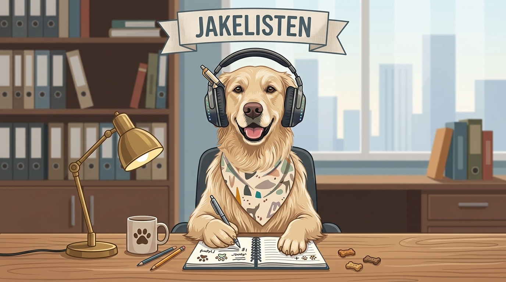

# 🐕 JakeListen

A lightweight command-line tool for macOS that records a call, transcribes it, and writes a short summary. It captures both sides of the conversation (your microphone and the system audio coming out of your speakers), sends the audio to Google Gemini for transcription, and produces a clean, speaker-labelled transcript plus an optional Slack-ready summary.

Named after Jake the dog.



> **100% AI-generated.** Every line of this project (the CLI, the Swift audio helper, the installer, and this README) was written by AI.

---

## What it does

- **Records both sides of a call** without any virtual audio driver. Your mic is captured with `ffmpeg`; the other participants are captured straight from the system audio output using macOS Core Audio process taps (macOS 14.2+). No BlackHole, no Multi-Output Device.
- **Transcribes with Gemini.** Each side is transcribed independently and merged by timestamp, so you get reliable speaker separation ("Me" vs. the other participants).
- **Handles long calls.** Recordings are split into overlapping chunks, transcribed in parallel, de-duplicated across the overlap, and stripped of silence so the model does not hallucinate on quiet stretches.
- **Summarises.** Produces a concise summary with participants, key points, decisions, and action items.
- **Posts to Slack (optional).** If you have a Slack CLI installed, it can post the summary to a channel of your choice.

Everything is saved locally under `~/JakeListen/recordings/` as `.wav` audio, a `.transcript.txt`, and a `.summary.txt`.

---

## Requirements

- **macOS 14.2 or newer** (the Core Audio process-tap API)
- **[Homebrew](https://brew.sh)**
- **Node.js 20+** and **ffmpeg**: `brew install node ffmpeg`
- **Xcode Command Line Tools** (to build the audio helper): `xcode-select --install`
- A **Google Gemini API key** (free): https://aistudio.google.com/apikey
- *(Optional)* a Slack CLI on your `PATH` as `slackcli` for posting summaries

---

## Install

From the project folder:

```bash
./install.sh
```

The installer checks prerequisites, builds the system-audio helper, links the `jakelisten` command, asks for your Gemini key, and walks you through the one-time macOS audio permission.

> **Grant the audio permission from the built-in Terminal.app.** Third-party terminals (Ghostty, Warp, iTerm) often do not show the permission prompt. The double-click launcher also runs in Terminal.app, so granting it there is exactly what it needs.

---

## Usage

```bash
jakelisten                 # menu: start a recording, or re-process a recent one
jakelisten record          # record a call, then transcribe + summarise
jakelisten transcribe FILE # transcribe + summarise an existing audio file
jakelisten process         # pick a recent recording and re-process it (retry after a failure)
jakelisten permission      # grant macOS system-audio recording (one-time)
jakelisten devices         # list audio input devices
jakelisten setup           # health check: config, ffmpeg, mic, permission
jakelisten config          # change Gemini key, models, name, Slack recipient
jakelisten help            # show help
```

To record: run `jakelisten`, take your call as usual (you still hear everyone), then press **Return** to stop. JakeListen transcribes, summarises, and (optionally) posts to Slack.

---

## First-run setup

The first time you record, JakeListen asks for a few things and saves them to `~/.jakelisten/config.json`:

- **Gemini API key** (required)
- **Your name** (optional): used to label your side of the call as `Me (Name)`
- **Domain context** (optional): names, jargon, or acronyms you want spelt correctly in the transcript, for example: `Project Acme; teammates Sam, Priya; acronyms KPI, SLA.`

Change any of these later with `jakelisten config`. You can also supply the key via the `GEMINI_API_KEY` environment variable.

Nothing is hard-coded. Your name, your jargon, and your Slack channel all live in your local config, never in the repo.

---

## How the audio capture works

The other side of the call is captured by a tiny Swift helper, `jakelisten-syscap`, built from `syscap/jakelisten-syscap.swift`. It creates a global Core Audio process tap over the system output mix and writes it to a file, while leaving playback untouched so you still hear the call. It is ad-hoc code-signed at build time so macOS can key the audio-capture permission to it.

Your microphone is captured separately by `ffmpeg` via `avfoundation`. Capturing the two channels independently is what gives clean, deterministic speaker separation.

If the helper is not built (for example, missing Xcode Command Line Tools), JakeListen still works but records your microphone only.

---

## Optional: a one-double-click setup for non-technical users

`Record Call.command` is a launcher you can drop on someone's Desktop so they never touch a terminal. Double-click to start, take the call, press **Return** to stop and process.

To set this up on their Mac:

1. Run `./install.sh` (it can place the launcher on the Desktop for you).
2. Run `jakelisten config` and set a default Slack recipient, then answer **yes** to "Auto-post to that channel without asking?" for a zero-decision flow.
3. Grant the audio permission from **Terminal.app** (see above). The first recording will also prompt once for microphone access.

---

## Configuration reference

`~/.jakelisten/config.json`:

| Key | Default | Meaning |
|---|---|---|
| `geminiApiKey` | `""` | Your Gemini API key (or set `GEMINI_API_KEY`) |
| `transcribeModel` | `gemini-3.1-pro-preview` | Model used for transcription |
| `model` | `gemini-3.5-flash` | Model used for the summary |
| `userName` | `""` | Your name, for the `Me (Name)` label |
| `transcribeContext` | `""` | Names/jargon to spell correctly |
| `micDevice` | `MacBook Air Microphone` | Mic device name (substring match) |
| `slackRecipient` | `""` | Default Slack channel/user id |
| `autoPostSlack` | `false` | Post to `slackRecipient` without asking |

---

## Privacy

Recording calls may require the consent of everyone involved depending on where you and they are located. Make sure you have it. Audio, transcripts, and summaries are written to your local disk; audio is uploaded to Google Gemini for transcription and summarisation under [Google's API terms](https://ai.google.dev/terms). Nothing else leaves your machine unless you choose to post a summary to Slack.

---

## Licence

MIT
