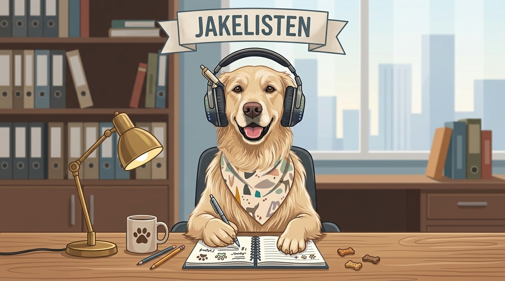

# JakeListen

A tiny, self-contained macOS app that records a meeting — **your mic and the other
participants** — and transcribes and summarizes it with Google Gemini. No BlackHole,
no virtual audio driver, no ffmpeg, no command line. Just an app. Named after Jake the
dog. 🦴

> **v3.0.1** — a clean-slate native rewrite. The old CLI + helper-binary + installer
> are gone; everything now lives in one Swift app.



## What it does

- 🎙️ **Records both sides** — your microphone via `AVAudioEngine`, and the meeting
  audio (everyone else, straight off your speakers) via macOS **Core Audio process
  taps**. Nothing to install.
- 📊 **Two live visualisers** while recording — one for your mic, one for the meeting —
  so you can *see* both sources are being picked up.
- 🗂️ **Every recording in the sidebar**, transcribed or not. If transcription fails,
  the recording stays put with a **Retry** button — you never lose the audio.
- 🗣️ **Speaker-labelled transcript** — your mic is labelled *Me*, the other
  participants are diarized (by name when it's spoken).
- 📝 **A short AI summary** — overview, participants, decisions, and action items.
- 🔑 **Your own Gemini key** — audio goes straight from your Mac to Google under your
  key. There's no JakeListen server in between. The key lives in your Keychain.

## Requirements

- **macOS 26 (Tahoe) or newer** (Core Audio process taps).
- A free **Google Gemini API key** — <https://aistudio.google.com/app/apikey>.
- To *build*: the Xcode Command Line Tools (`xcode-select --install`). To *run* a
  prebuilt copy: nothing.

## Build & run

```bash
cd mac-app
./build.sh --run
```

That compiles `mac-app/Sources/*.swift` with `swiftc`, bundles `JakeListen.app`, signs
it with a stable self-signed identity (so macOS recording permissions survive
rebuilds), and launches it.

On first launch, paste your Gemini API key. The first recording asks macOS for
**Microphone** and **System Audio Recording** permission — allow both, and you're set.

## How it fits together

| File | Role |
| --- | --- |
| `AudioRecorder.swift` | Mic capture + orchestration + live levels |
| `SystemAudioTap.swift` | System-audio capture via Core Audio process taps |
| `AudioTrackWriter.swift` | Downmix to 16 kHz mono `.m4a` + meter level |
| `Recording.swift` | On-disk recording model + store |
| `GeminiClient.swift` | Gemini File API upload + `generateContent` |
| `Transcriber.swift` | Two tracks → merged *Me*/others transcript + summary |
| `AppModel.swift` | Recording list, record control, transcription state |
| `*View.swift` | SwiftUI window, sidebar, detail, visualisers, settings |

Recordings are stored at
`~/Library/Application Support/JakeListen/Recordings/<timestamp>/`.

## Sharing it with coworkers

See [`mac-app/DISTRIBUTING.md`](mac-app/DISTRIBUTING.md). Short version: for a clean
double-click-and-go experience, enroll in the Apple Developer Program ($99/yr) and
sign + notarize with a Developer ID; for a few technical coworkers today, zip the app
and right-click → Open.

## The honest bit

JakeListen is written entirely by AI. It works, it's open source, read every line
yourself. MIT licensed.
