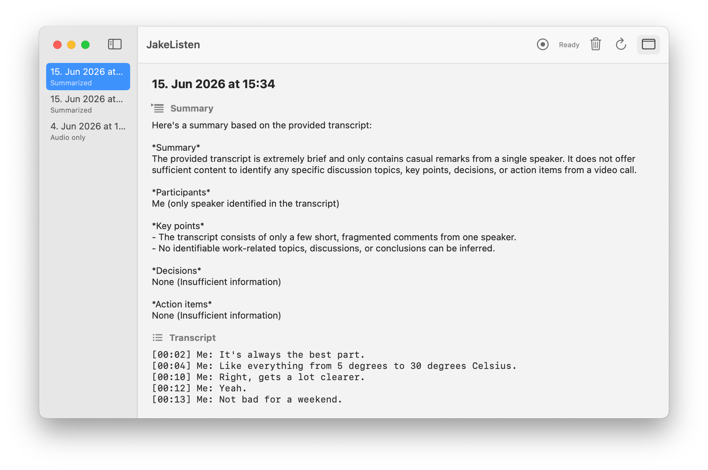
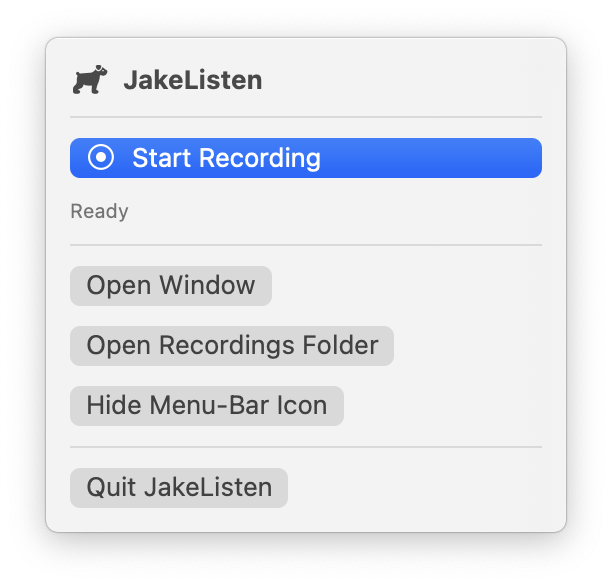

# JakeListen for Mac (GUI)

A small native **menu-bar + window** front-end for the `jakelisten` command-line
tool. It doesn't re-implement anything — it drives the existing CLI, so the audio
capture, transcription, and summary pipeline are identical to the terminal
version.



<p align="center">
  
</p>

## What it gives you

- **A menu-bar icon** (🐕 → ⏺ while recording) to start/stop a recording with one
  click — no terminal needed.
- **A window** listing every past call with its **summary** and **transcript**.
- Live elapsed-time and status while recording and processing.
- **Delete** recordings (right-click a call, or select it and press ⌫) — files
  go to the Trash, so it's recoverable.
- **Hideable menu-bar icon** — turn it off from the menu-bar popover, the window
  toolbar, or Settings (⌘,), and back on the same way.

## Requirements

The GUI is a thin wrapper, so you need the CLI working first:

1. Install the CLI from the repo root: `./install.sh`
2. Confirm it's healthy: `jakelisten setup`

Build requirements: macOS 14.2+ and the **Xcode Command Line Tools**
(`xcode-select --install`). A full Xcode install is **not** required.

## Build & run

```bash
cd mac-app
./build.sh --run
```

This compiles `build/JakeListen.app` with `swiftc` and launches it. To install it
permanently, drag `build/JakeListen.app` into `/Applications`.

## How it works

- **Start** spawns `jakelisten record` (which begins recording immediately).
- **Stop** writes a newline to the process's stdin — exactly what pressing
  **Enter** does in the terminal — which tells the CLI to stop and run
  transcription + summary.
- When the process finishes, the window refreshes from
  `~/JakeListen/recordings/` and selects the new call.

Because GUI apps don't inherit your shell's `PATH`, the app looks for the CLI at
`/opt/homebrew/bin/jakelisten` and `/usr/local/bin/jakelisten`, then falls back
to a login shell lookup. It also prepends Homebrew paths to the child process
environment so `node`, `ffmpeg`, and the Core Audio helper resolve.

## Permissions

The first time you record from the app, macOS will ask for **microphone** and
**system-audio recording** permission for *JakeListen.app* (separate from the
grant you gave Terminal). Click **Allow**. If you miss the system-audio prompt:
System Settings → Privacy & Security → *Screen & System Audio Recording* →
enable JakeListen.

## Slack

The app records with `jakelisten record --no-slack`, so the CLI never blocks on
its interactive Slack prompt. Instead, **if `slackcli` is installed**, the app
shows a small "Post summary to Slack?" sheet after each recording — enter a
channel (name or id) and **Post**, or **Skip**. Posting is routed through the
CLI's scriptable `jakelisten post <summary-file> <channel>` command, so channel
name → id resolution stays in one place.

If `slackcli` isn't installed, no prompt appears — the transcript/summary are
just saved locally.

## Notes / limitations

- This is a wrapper, not a reimplementation; CLI behavior is the source of truth.
